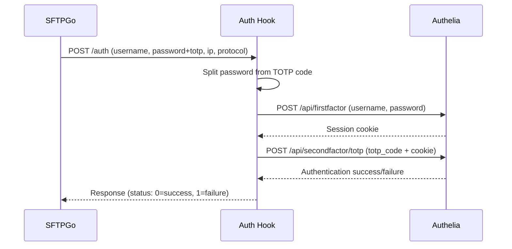

# Satph - SFTPGo Authelia TOTP Password Hook

A high-performance authentication hook service for [SFTPGo](https://github.com/drakkan/sftpgo) that integrates with [Authelia](https://www.authelia.com/) for two-factor authentication (2FA) using Time-based One-Time Passwords (TOTP).

This service allows SFTPGo to authenticate users against Authelia's authentication backend, supporting both traditional password authentication and TOTP-based second factor authentication.

## Features

- 🔐 **Two-Factor Authentication**: Seamless integration with Authelia's TOTP authentication
- 🚀 **High Performance**: Built with Rust and async/await for maximum throughput
- 📊 **Structured Logging**: Comprehensive tracing with configurable log levels
- 🐳 **Docker Ready**: Multi-platform Docker images (AMD64/ARM64)
- 🔧 **Configurable**: Environment-based configuration
- 🛡️ **Secure**: Built-in TLS support with optional certificate validation bypass
- 📈 **Production Ready**: Health checks, graceful shutdown, and error handling
- 🧪 **Well Tested**: Comprehensive unit test suite

## How It Works



1. SFTPGo sends authentication requests to the hook service
2. The hook splits the password and TOTP code (last 6 digits)
3. First factor authentication is performed with username/password against Authelia
4. If successful, second factor authentication is performed with the TOTP code
5. The result is returned to SFTPGo

## Specification Compliance

This service implements the [SFTPGo Check Password Hook specification](https://docs.sftpgo.com/2.6/check-password-hook/), ensuring full compatibility with SFTPGo's authentication system.

### Hook Interface

The service provides a REST API endpoint that accepts authentication requests in the format expected by SFTPGo:

**Request Format:**
```json
{
  "username": "alice",
  "password": "userpassword123456",
  "ip": "192.168.1.100",
  "protocol": "SFTP"
}
```

**Response Format:**
- `200 OK` with `{"status": 0}` for successful authentication
- `200 OK` with `{"status": 1}` for failed authentication
- `500 Internal Server Error` for system errors

### Protocol Support

The hook supports all SFTPGo protocols:
- **SFTP** - SSH File Transfer Protocol
- **SCP** - Secure Copy Protocol  
- **SSH** - Secure Shell
- **FTP** - File Transfer Protocol (over TLS)
- **DAV** - WebDAV
- **HTTP** - HTTP File Server

## Installation

### Docker (Recommended)

```bash
# Pull the latest image
docker pull ghcr.io/danielramosacosta/sftpgo-authelia-totp-hook:latest

# Run with environment variables
docker run -d \
  --name sftpgo-auth-hook \
  -p 8080:8080 \
  -e AUTHELIA_BASE_URL=https://your-authelia-domain.com \
  -e LOG_LEVEL=info \
  ghcr.io/danielramosacosta/sftpgo-authelia-totp-hook:latest
```

### Docker Compose

```yaml
version: '3.8'
services:
  sftpgo-auth-hook:
    image: ghcr.io/danielramosacosta/sftpgo-authelia-totp-hook:latest
    environment:
      AUTHELIA_BASE_URL: https://your-authelia-domain.com
      HTTP_BIND: 0.0.0.0:8080
      LOG_LEVEL: info
    ports:
      - "8080:8080"
    restart: unless-stopped
```

### From Source

```bash
# Clone the repository
git clone https://github.com/DanielRamosAcosta/sftpgo-authelia-totp-hook
cd sftpgo-authelia-totp-hook

# Build and run
cargo build --release
AUTHELIA_BASE_URL=https://your-authelia-domain.com ./target/release/sftpgo-authelia-totp-hook
```

## Configuration

Configure the service using environment variables:

| Variable | Description | Default | Required |
|----------|-------------|---------|----------|
| `AUTHELIA_BASE_URL` | Base URL of your Authelia instance | - | ✅ |
| `HTTP_BIND` | Address and port to bind the HTTP server | `0.0.0.0:8080` | ❌ |
| `HTTP_CLIENT_TIMEOUT_MS` | HTTP client timeout in milliseconds | `5000` | ❌ |
| `LOG_LEVEL` | Log level (trace, debug, info, warn, error) | `info` | ❌ |
| `TLS_INSECURE` | Skip TLS certificate verification | `false` | ❌ |

### Example Configuration

```bash
export AUTHELIA_BASE_URL=https://auth.yourdomain.com
export HTTP_BIND=0.0.0.0:8080
export HTTP_CLIENT_TIMEOUT_MS=10000
export LOG_LEVEL=debug
export TLS_INSECURE=false
```

## SFTPGo Integration

Configure SFTPGo to use this authentication hook by adding the following to your SFTPGo configuration:

### sftpgo.json
```json
{
  "httpd": {
    "bindings": [
      {
        "port": 8081,
        "address": "0.0.0.0"
      }
    ]
  },
  "hooks": {
    "external_auth_hook": "http://localhost:8080/auth",
    "external_auth_scope": 7
  }
}
```

### Docker Compose with SFTPGo
```yaml
version: '3.8'
services:
  sftpgo:
    image: drakkan/sftpgo:latest
    ports:
      - "2022:2022"  # SFTP
      - "8081:8080"  # Web UI
    environment:
      SFTPGO_HTTPD__BINDINGS__0__PORT: 8080
      SFTPGO_HOOKS__EXTERNAL_AUTH_HOOK: http://auth-hook:8080/auth
      SFTPGO_HOOKS__EXTERNAL_AUTH_SCOPE: 7
    depends_on:
      - auth-hook

  auth-hook:
    image: ghcr.io/danielramosacosta/sftpgo-authelia-totp-hook:latest
    environment:
      AUTHELIA_BASE_URL: https://your-authelia-domain.com
    expose:
      - "8080"
```

## User Authentication

Users authenticate by providing their password followed immediately by their TOTP code:

```
Password Format: [your_password][totp_code]
Example: mypassword123456
```

Where:
- `mypassword` is the user's regular password
- `123456` is the 6-digit TOTP code from their authenticator app

## API Endpoints

### POST /auth
Authentication endpoint for SFTPGo integration.

**Request:**
```json
{
  "username": "alice",
  "password": "mypassword123456",
  "ip": "192.168.1.100",
  "protocol": "SFTP"
}
```

**Response (Success):**
```json
{
  "status": 0
}
```

**Response (Failure):**
```json
{
  "status": 1,
  "message": "Authentication failed, please retry later."
}
```

### GET /health
Health check endpoint.

**Response:**
```json
{
  "status": "ok",
  "version": "0.1.0"
}
```

## Development

### Prerequisites
- Rust 1.70+ (specified in `rust-toolchain.toml`)
- Docker (for containerized development)

### Local Development

```bash
# Clone and setup
git clone https://github.com/DanielRamosAcosta/sftpgo-authelia-totp-hook
cd sftpgo-authelia-totp-hook

# Install dependencies for security auditing
cargo install cargo-audit

# Run all CI checks locally
just ci

# Run in development mode with auto-reload
just watch

# Build Docker image
just docker-build

# Run Docker container
just docker-run
```

### Available Commands (just)

```bash
just fmt          # Format code
just fmt-check    # Check formatting
just clippy       # Run clippy linter
just test         # Run tests
just audit        # Security audit
just ci           # Run all CI checks
just build        # Build project
just run          # Run application
just docker-build # Build Docker image
just docker-run   # Run Docker container
```

### Testing

The project includes comprehensive unit tests covering:

- Domain logic validation
- Authentication flows
- HTTP controller behavior
- Configuration parsing
- Error handling

```bash
# Run tests
cargo test

# Run tests with output
cargo test -- --nocapture

# Run specific test
cargo test test_authenticate_success
```

## Monitoring and Logging

The service provides structured logging with configurable levels:

```bash
# Set log level
export LOG_LEVEL=debug

# Example log output
2025-08-13T18:54:26.962230Z INFO auth_request{trace_id=bd3c95ef-2b59-4f8e-9b1e-ea54d472cb76}: sftpgo_authelia_totp_hook::domain::auth_service: Authentication successful username=alice ip=192.168.1.200 protocol=SFTP
```

Each request gets a unique trace ID for correlation across log entries.

## Security Considerations

- **TLS**: Always use HTTPS for Authelia communication in production
- **Network Security**: Run the hook service in a secure network segment
- **Log Sanitization**: Passwords and TOTP codes are never logged
- **Timeouts**: Configurable HTTP timeouts prevent hanging requests
- **Input Validation**: All inputs are validated before processing

## Troubleshooting

### Common Issues

1. **Connection Refused**
   ```
   ERROR: Failed to connect to Authelia: error sending request
   ```
   - Check `AUTHELIA_BASE_URL` is correct and accessible
   - Verify network connectivity
   - Check TLS certificate validity

2. **Authentication Failures**
   ```
   WARN: Second factor TOTP authentication failed status=403 Forbidden
   ```
   - Verify TOTP code is correct (6 digits)
   - Check time synchronization
   - Ensure user has TOTP configured in Authelia

3. **Configuration Errors**
   ```
   ERROR: Failed to load configuration
   ```
   - Verify all required environment variables are set
   - Check URL format for `AUTHELIA_BASE_URL`

### Debug Mode

Enable debug logging for detailed troubleshooting:

```bash
export LOG_LEVEL=debug
```

## Contributing

1. Fork the repository
2. Create a feature branch: `git checkout -b feature/amazing-feature`
3. Make your changes and add tests
4. Run the CI checks: `just ci`
5. Commit your changes: `git commit -m 'Add amazing feature'`
6. Push to the branch: `git push origin feature/amazing-feature`
7. Open a Pull Request

## License

This project is licensed under the MIT License - see the [LICENSE](LICENSE) file for details.

## Acknowledgments

- [SFTPGo](https://github.com/drakkan/sftpgo) - Secure FTP server
- [Authelia](https://www.authelia.com/) - Authentication and authorization server
- [Rust](https://rust-lang.org/) - Systems programming language
- [Actix Web](https://actix.rs/) - Web framework for Rust

## Architecture

### Domain-Driven Design

The project follows Domain-Driven Design principles with clear separation of concerns:

```
src/
├── domain/           # Core business logic
│   ├── auth_service.rs
│   ├── authelia.rs
│   ├── password.rs
│   └── username.rs
├── infrastructure/   # External integrations
│   ├── authelia_http_client.rs
│   └── http/
│       ├── controllers.rs
│       └── routes.rs
└── main.rs          # Application entry point
```

### Error Handling

The application uses Rust's robust error handling with custom error types:

- `AuthError`: Domain-specific authentication errors
- `ConfigError`: Configuration validation errors
- Proper error propagation with `?` operator
- User-friendly error messages

---

For more information, visit the [GitHub repository](https://github.com/DanielRamosAcosta/sftpgo-authelia-totp-hook) or open an issue for support.
